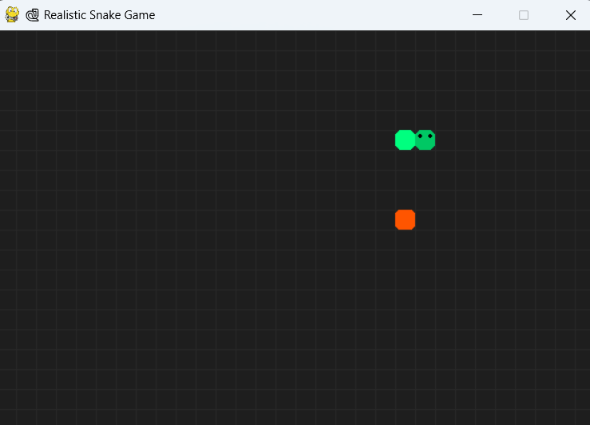

# 🐍 Snake Game 02

A fun and visually enhanced version of the classic **Snake Game**, built using **Python** and **Pygame**.  
It features grid-based movement, smooth animations, eye-tracking on the snake head, a stylish game UI, and a game-over screen with score tracking.

---

## ✨ Features

- 🎮 Real-time keyboard control (arrow keys)  
- 👁️ Snake head with animated eyes  
- 🍎 Random food spawning  
- 📈 Dynamic score display  
- 💀 Game Over screen with Restart/Quit options  
- 📏 Grid-based board for clean visuals  
- 🎨 Smooth, colorful UI and responsive layout  

---

## 🧠 Tech Stack

- 🐍 Python 3.11  
- 🎮 Pygame 2.6+

---

## ⚙️ How to Run

### 🔹 1. Clone the Repository

```bash
git clone https://github.com/ANGSHUMAN-10000/snake_game_02.git
cd snake_game_02
```

### 🔹 2. Install Dependencies

Make sure Python and `pip` are installed, then run:

```bash
pip install pygame
```

### 🔹 3. Run the Game

```bash
python snake2.py
```

---

## 🎮 Controls

| Key 🔑 | Action 🎯        |
|--------|------------------|
| ⬆️     | Move Up          |
| ⬇️     | Move Down        |
| ⬅️     | Move Left        |
| ➡️     | Move Right       |
| `R`    | Restart Game     |
| `Q`    | Quit the Game    |

---

## 📸 Screenshot



---

## 🙌 Credits

Developed by **Angshuman Singha**  
🔗 [GitHub: @ANGSHUMAN-10000](https://github.com/ANGSHUMAN-10000)  
Made with ❤️ in Python

---

## 📃 License

🆓 This project is open-source and free for personal and educational use.

---

## ⭐ Support

If you enjoyed this project, consider **starring** ⭐ it on GitHub and sharing it!
